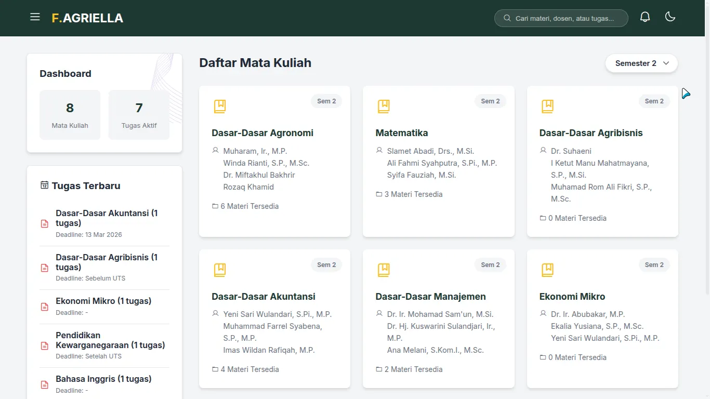
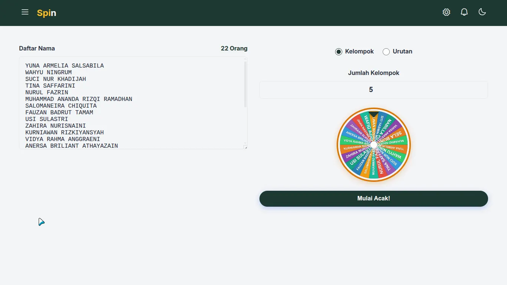
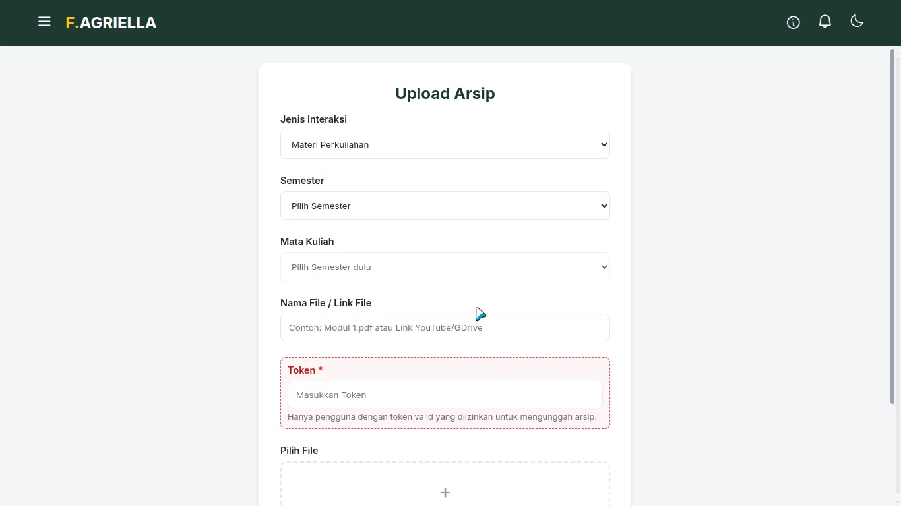
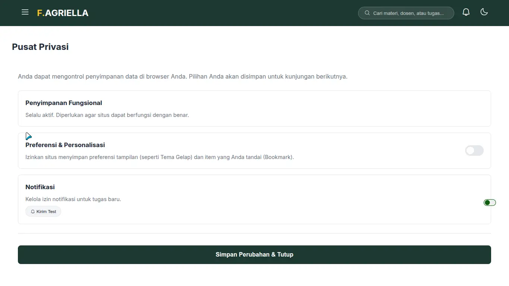

# 📘 Panduan Penggunaan Website Arsip F.AGRIELLA

Selamat datang di website **Arsip F.AGRIELLA**. Platform ini dirancang untuk memudahkan mahasiswa dalam mengakses materi perkuliahan, memantau tugas, dan menggunakan alat bantu belajar lainnya dengan antarmuka yang modern dan responsif.

---

## 🎮 Panduan Menu & Sub-Menu (Detailed Guide)

Berikut adalah panduan lengkap cara menggunakan setiap fitur dan menu tambahan (sub-menu) yang ada di website ini:

### 1. 🏠 Beranda (Home)

Halaman awal untuk melihat gambaran umum isi website.
- **Pencarian Cepat:** Gunakan kolom pencarian di bagian atas untuk mencari nama mata kuliah, dosen, nama file, atau deskripsi tugas secara instan.
- **Card Mata Kuliah (Sub-Menu Materi):** Klik pada kartu mata kuliah untuk membuka jendela detail (**Modal Detail Materi**). Di dalamnya terdapat dua tab:
    - **Tab Dokumen:** Daftar file PDF, Word, PPT, dll. Klik nama file untuk mengunduh atau melihat.
    - **Tab Foto:** Kumpulan foto atau tangkapan layar materi yang terkait dengan mata kuliah tersebut.
- **Side Dashboard (Sidebar):** 
    - **Statistik:** Melihat jumlah total mata kuliah dan tugas yang sedang aktif.
    - **Tugas Terbaru:** Daftar tugas harian. Klik pada item tugas untuk membuka **Modal Detail Tugas** yang berisi deskripsi lengkap dan link pengumpulan.
    - **Bookmark:** Daftar akses cepat untuk materi yang sering Anda buka (disimpan secara lokal).

### 2. 🖼️ Arsip Foto
Kumpulan dokumentasi visual yang dikelompokkan berdasarkan album.
- **Filter Semester:** Gunakan dropdown semester untuk menyaring album foto berdasarkan periode perkuliahan.
- **Navigasi Album:** Klik pada kartu album untuk melihat isi foto di dalamnya.
- **Melihat Foto:** Klik pada foto untuk membukanya dalam ukuran penuh (Lightbox) atau di tab baru.

### 3. 🎲 Spin (Undian)

Alat pengundian acak dengan fitur kustomisasi tingkat lanjut.
- **Input Data:** Masukkan daftar peserta di kolom kiri (satu nama per baris). Jumlah peserta akan terhitung otomatis di bagian atas.
- **Mode Pilihan:** 
    - **Kelompok:** Membagi daftar nama ke dalam sejumlah kelompok.
    - **Urutan:** Memilih satu atau beberapa pemenang/urutan dari daftar.
- **Konfigurasi (Icon Gerigi ⚙️):** 
    - **Lama Putaran:** Atur durasi animasi bola spin (1-60 detik).
    - **Skip Animation:** Aktifkan jika ingin hasil keluar seketika tanpa animasi.
- **Aksi & Hasil:** 
    - **Mulai Acak:** Menjalankan animasi dan menampilkan hasil.
    - **Riwayat Hasil:** Hasil muncul dalam grid di bagian bawah. Anda bisa membagikan hasil ke WhatsApp atau melihat dalam mode Fullscreen.
    - **Reset:** Menghapus semua riwayat dan daftar nama untuk memulai sesi baru.

### 4. 📤 Upload Materi

Kontribusikan materi, foto, atau tugas Anda ke dalam database bersama. Menu ini memiliki **5 Jenis Interaksi** utama:
- **Langkah-Langkah Umum:**
    1. **Pilih Jenis Interaksi:** Pilih apakah Anda ingin upload Materi, Foto, Tugas, atau menggunakan AI.
    2. **Isi Semester:** Pilih semester terkait dari dropdown yang tersedia.
    3. **Pilih Mata Kuliah / Album:** Setelah semester dipilih, daftar mata kuliah akan muncul secara otomatis. Untuk foto, Anda bisa mengetik nama album baru.
    4. **Isi Deskripsi/Nama File:** Masukkan judul materi atau tempelkan link (YouTube/GDrive/Google Maps).
    5. **Input Token:** Masukkan kode keamanan (Token) yang valid agar sistem mengizinkan proses simpan.
    6. **Pilih File:** Seret atau klik area dropzone untuk memilih file dari komputer Anda (mendukung banyak file sekaligus).
    7. **Kirim:** Klik tombol "Upload" dan tunggu notifikasi sukses muncul di layar.

- **Fitur Khusus:**
    - **Tugas Kuliah (Manual):** Menambahkan field khusus untuk Nama Dosen, Deadline (Tenggat Waktu), dan Catatan pengerjaan.
    - **Generate Tugas via AI:** Cukup paste pesan chat WhatsApp yang panjang berisi jadwal/tugas, AI Groq akan menganalisis dan memasukkannya otomatis ke sistem.
    - **Hapus Arsip:** Untuk menghapus materi yang salah upload (memerlukan Token khusus admin).
- **Panduan Upload (Sub-Menu Bantuan):** Klik ikon (?) di navbar saat berada di menu Upload untuk membuka panduan teknis mendalam tentang format file dan cara kontribusi yang benar.

### 5. ⚙️ Pengaturan (Settings)

Menu untuk personalisasi pengalaman pengguna:
- **Tema Gelap/Terang:** Klik ikon bulan/matahari untuk kenyamanan mata.
- **Notifikasi Push (Webpushr):** 
    - Aktifkan toggle untuk berlangganan info tugas terbaru.
    - **Kirim Test:** Klik untuk menguji apakah notifikasi masuk ke HP/Laptop Anda.
- **Izin Personalitas:** Jika diaktifkan, website akan mengingat pilihan tema dan daftar bookmark Anda di browser ini.

### 6. 🔔 Info Panel & Navigasi Utama
- **Lonceng Notifikasi (Pengumuman):** Klik ikon lonceng di navbar untuk melihat daftar pengumuman terbaru dari admin.
- **Detail Tugas (Sub-Menu Sidebar):** Di bagian sidebar "Tugas Terbaru", klik pada salah satu tugas untuk membuka **Modal Detail Tugas**. Di sini Anda bisa melihat link dokumen tugas dan catatan tambahan dari dosen.
- **Sync Spinner:** Ikon berputar di dekat logo menunjukkan website sedang menyinkronkan data terbaru dari server.
- **Halaman Tentang:** Informasi latar belakang pembuatan website Arsip F.AGRIELLA.

### 7. ⭐ Fitur Tambahan: Bookmark & Filter
- **Cara Menambah Bookmark:** Pada setiap list materi atau tugas di dalam modal, klik ikon **Bintang (Star)** untuk menyimpannya ke daftar akses cepat.
- **Melihat Bookmark:** Bookmark yang Anda simpan akan muncul di Sidebar Dashboard (kiri) dan secara otomatis difilter berdasarkan semester yang sedang aktif.
- **Filter Semester:** Gunakan dropdown semester di Beranda atau Arsip Foto untuk hanya menampilkan data dari periode tertentu.

---

## 🛠️ Panduan Integrasi (Admin Guide)

Website ini menggunakan **Google Sheets** sebagai database. Berikut adalah konfigurasi yang diperlukan:

### 1. Persiapan Google Sheet
Pastikan Spreadsheet Anda memiliki tab dengan struktur kolom sebagai berikut (huruf kecil semua):

- **Tab `Courses`**: Kolom: `name`, `dosen`, `semester`, `pic`.
- **Tab `Materials`**: Kolom: `course`, `filename`, `date`, `type`, `size`, `link`.
- **Tab `Assignments`**: Kolom: `date`, `course`, `lecturer`, `description`, `deadline`, `note`.
- **Tab `arsipfoto`**: Kolom: `album`, `course`, `filename`, `date`, `link`.
- **Tab `InfoPanel`**: Kolom: `tanggal`, `kategori`, `judul`, `isi`.

---
*Semoga website ini membantu kelancaran studi Anda!*
